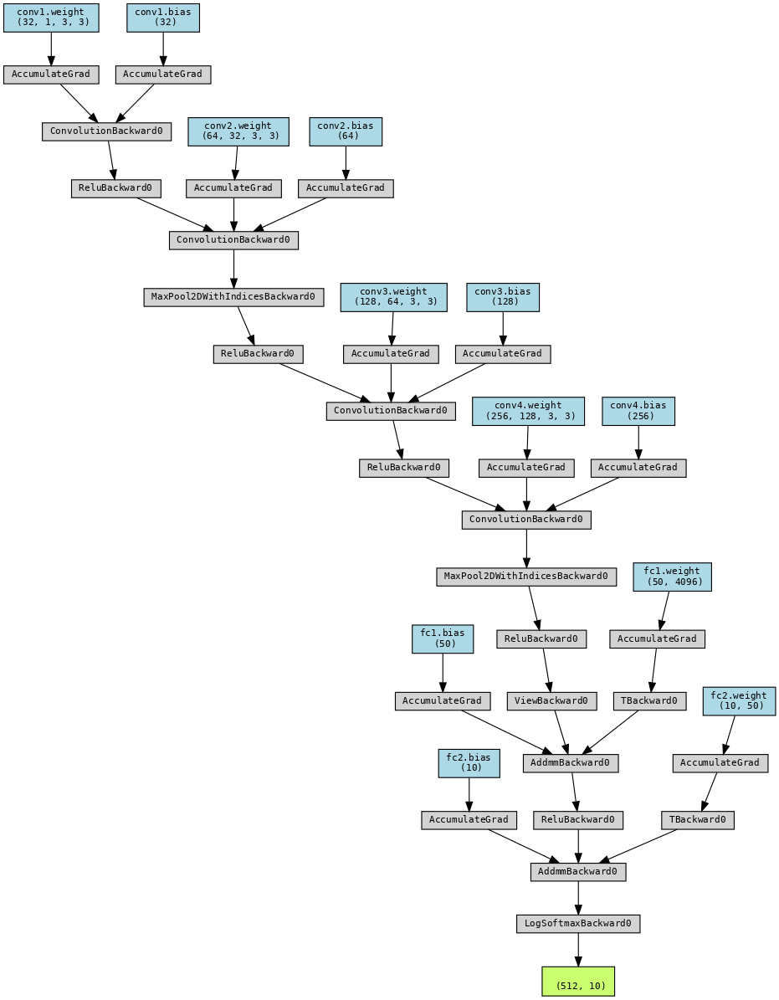

# Train Mnist Model

This repo contains code to train mnist from scratch. We have also divided code in a way that it can be reused for any other network training.

You can follow steps along using notebook shared [S5.ipynb](./S5.ipynb)  

### Install Requirements

    pip install -r requirements.txt

## Define Network

Network used here contains total of `593,200` params and architecture as as follows

 

## Train Network

We have treained network for 20 epochs and following out put with train accuracy of 99.07% and test acuracy of 99.31%

```
Adjusting learning rate of group 0 to 1.0000e-02.
Epoch 1
Train: Loss=1.9693 Batch_id=117 Accuracy=29.13: 100%|██████████| 118/118 [00:09<00:00, 12.29it/s]
Test set: Average loss: 1.8297, Accuracy: 4257/10000 (42.57%)

Adjusting learning rate of group 0 to 1.0000e-02.
Epoch 2
Train: Loss=0.3549 Batch_id=117 Accuracy=76.67: 100%|██████████| 118/118 [00:09<00:00, 11.97it/s]
Test set: Average loss: 0.1447, Accuracy: 9563/10000 (95.63%)

Adjusting learning rate of group 0 to 1.0000e-02.
Epoch 3
Train: Loss=0.1194 Batch_id=117 Accuracy=94.88: 100%|██████████| 118/118 [00:09<00:00, 11.87it/s]
Test set: Average loss: 0.0924, Accuracy: 9716/10000 (97.16%)

Adjusting learning rate of group 0 to 1.0000e-02.
Epoch 4
Train: Loss=0.0757 Batch_id=117 Accuracy=96.45: 100%|██████████| 118/118 [00:09<00:00, 12.02it/s]
Test set: Average loss: 0.0625, Accuracy: 9799/10000 (97.99%)

Adjusting learning rate of group 0 to 1.0000e-02.
Epoch 5
Train: Loss=0.1090 Batch_id=117 Accuracy=97.28: 100%|██████████| 118/118 [00:09<00:00, 11.92it/s]
Test set: Average loss: 0.0454, Accuracy: 9860/10000 (98.60%)

Adjusting learning rate of group 0 to 1.0000e-02.
Epoch 6
Train: Loss=0.1272 Batch_id=117 Accuracy=97.56: 100%|██████████| 118/118 [00:10<00:00, 11.18it/s]
Test set: Average loss: 0.0418, Accuracy: 9872/10000 (98.72%)

Adjusting learning rate of group 0 to 1.0000e-02.
Epoch 7
Train: Loss=0.0199 Batch_id=117 Accuracy=97.72: 100%|██████████| 118/118 [00:10<00:00, 10.83it/s]
Test set: Average loss: 0.0331, Accuracy: 9896/10000 (98.96%)

Adjusting learning rate of group 0 to 1.0000e-02.
Epoch 8
Train: Loss=0.0592 Batch_id=117 Accuracy=97.99: 100%|██████████| 118/118 [00:10<00:00, 11.29it/s]
Test set: Average loss: 0.0327, Accuracy: 9883/10000 (98.83%)

Adjusting learning rate of group 0 to 1.0000e-02.
Epoch 9
Train: Loss=0.0554 Batch_id=117 Accuracy=98.18: 100%|██████████| 118/118 [00:10<00:00, 11.79it/s]
Test set: Average loss: 0.0297, Accuracy: 9902/10000 (99.02%)

Adjusting learning rate of group 0 to 1.0000e-02.
Epoch 10
Train: Loss=0.0526 Batch_id=117 Accuracy=98.35: 100%|██████████| 118/118 [00:10<00:00, 11.33it/s]
Test set: Average loss: 0.0331, Accuracy: 9898/10000 (98.98%)

Adjusting learning rate of group 0 to 1.0000e-02.
Epoch 11
Train: Loss=0.0824 Batch_id=117 Accuracy=98.42: 100%|██████████| 118/118 [00:10<00:00, 11.58it/s]
Test set: Average loss: 0.0341, Accuracy: 9885/10000 (98.85%)

Adjusting learning rate of group 0 to 1.0000e-02.
Epoch 12
Train: Loss=0.0652 Batch_id=117 Accuracy=98.53: 100%|██████████| 118/118 [00:10<00:00, 11.79it/s]
Test set: Average loss: 0.0240, Accuracy: 9922/10000 (99.22%)

Adjusting learning rate of group 0 to 1.0000e-02.
Epoch 13
Train: Loss=0.0152 Batch_id=117 Accuracy=98.69: 100%|██████████| 118/118 [00:10<00:00, 11.71it/s]
Test set: Average loss: 0.0245, Accuracy: 9917/10000 (99.17%)

Adjusting learning rate of group 0 to 1.0000e-02.
Epoch 14
Train: Loss=0.0501 Batch_id=117 Accuracy=98.76: 100%|██████████| 118/118 [00:10<00:00, 11.78it/s]
Test set: Average loss: 0.0248, Accuracy: 9915/10000 (99.15%)

Adjusting learning rate of group 0 to 1.0000e-02.
Epoch 15
Train: Loss=0.0901 Batch_id=117 Accuracy=98.75: 100%|██████████| 118/118 [00:10<00:00, 10.86it/s]
Test set: Average loss: 0.0241, Accuracy: 9916/10000 (99.16%)

Adjusting learning rate of group 0 to 1.0000e-03.
Epoch 16
Train: Loss=0.0543 Batch_id=117 Accuracy=99.00: 100%|██████████| 118/118 [00:09<00:00, 12.45it/s]
Test set: Average loss: 0.0206, Accuracy: 9932/10000 (99.32%)

Adjusting learning rate of group 0 to 1.0000e-03.
Epoch 17
Train: Loss=0.0248 Batch_id=117 Accuracy=99.07: 100%|██████████| 118/118 [00:09<00:00, 11.81it/s]
Test set: Average loss: 0.0202, Accuracy: 9930/10000 (99.30%)

Adjusting learning rate of group 0 to 1.0000e-03.
Epoch 18
Train: Loss=0.0368 Batch_id=117 Accuracy=99.12: 100%|██████████| 118/118 [00:09<00:00, 12.02it/s]
Test set: Average loss: 0.0200, Accuracy: 9927/10000 (99.27%)

Adjusting learning rate of group 0 to 1.0000e-03.
Epoch 19
Train: Loss=0.0138 Batch_id=117 Accuracy=99.13: 100%|██████████| 118/118 [00:09<00:00, 11.92it/s]
Test set: Average loss: 0.0195, Accuracy: 9930/10000 (99.30%)

Adjusting learning rate of group 0 to 1.0000e-03.
Epoch 20
Train: Loss=0.0105 Batch_id=117 Accuracy=99.07: 100%|██████████| 118/118 [00:10<00:00, 11.39it/s]
Test set: Average loss: 0.0191, Accuracy: 9931/10000 (99.31%)

Adjusting learning rate of group 0 to 1.0000e-03.
```

Following is graph for training outcomes

[plot](plot.png)

