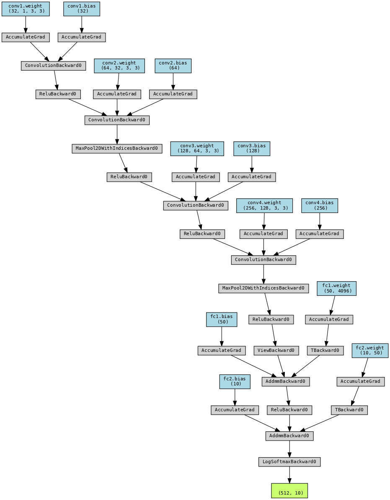

# Train Mnist Model

This repo contains code to train mnist from scratch. We have also divided code in a way that it can be reused for any other network training.

### Install Requirements

    pip install -r requirements.txt

## Define Network

Network used here contains total of 593,200 params and architecture as as follows

  
